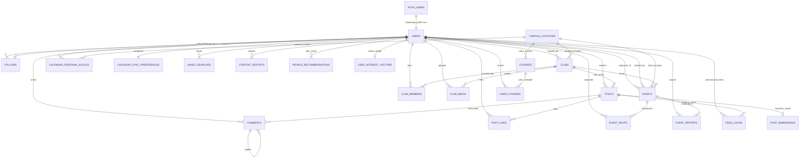
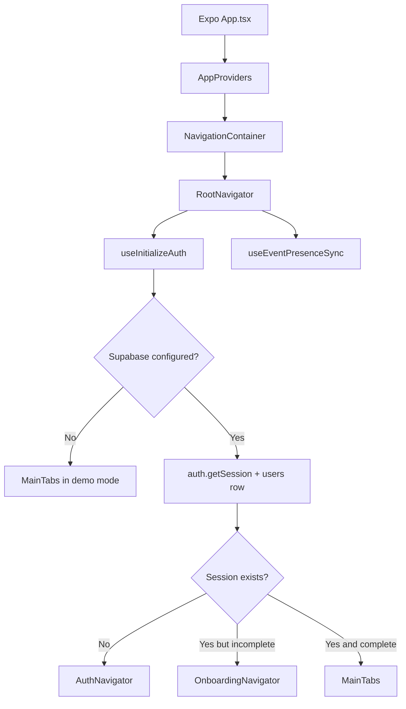
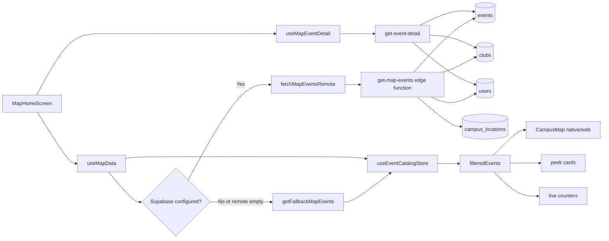
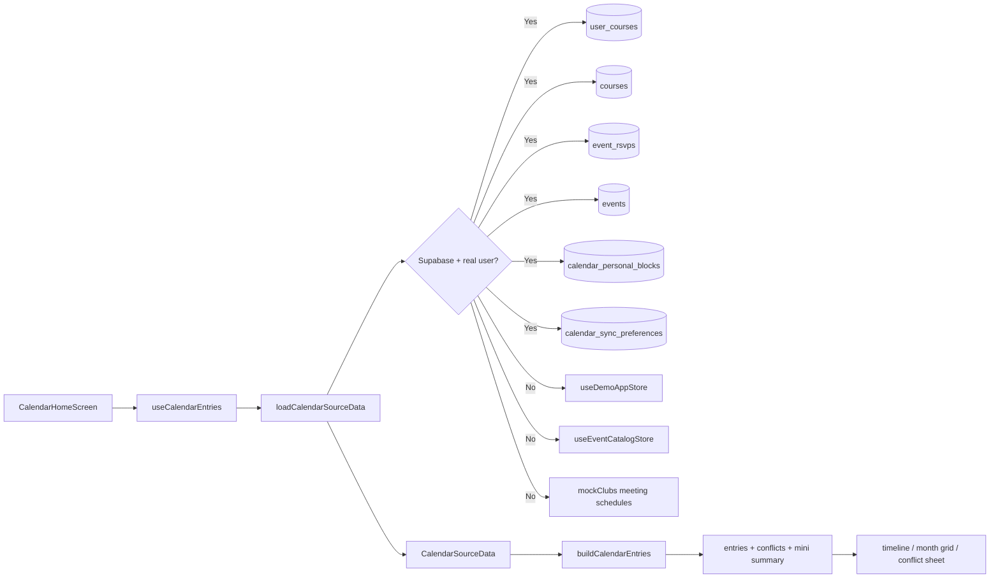
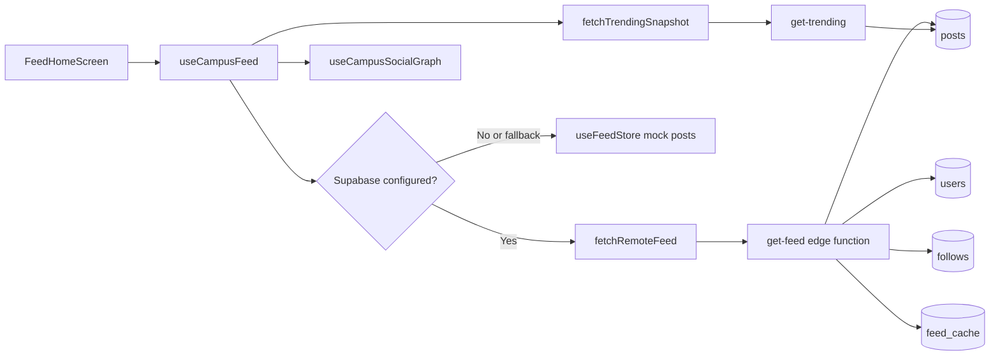
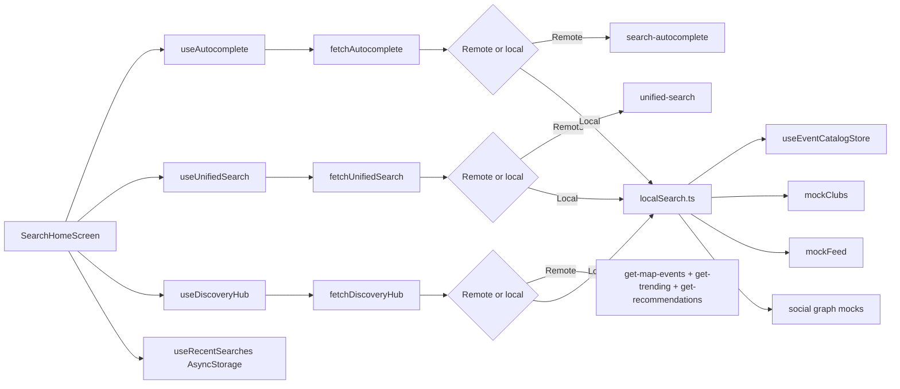
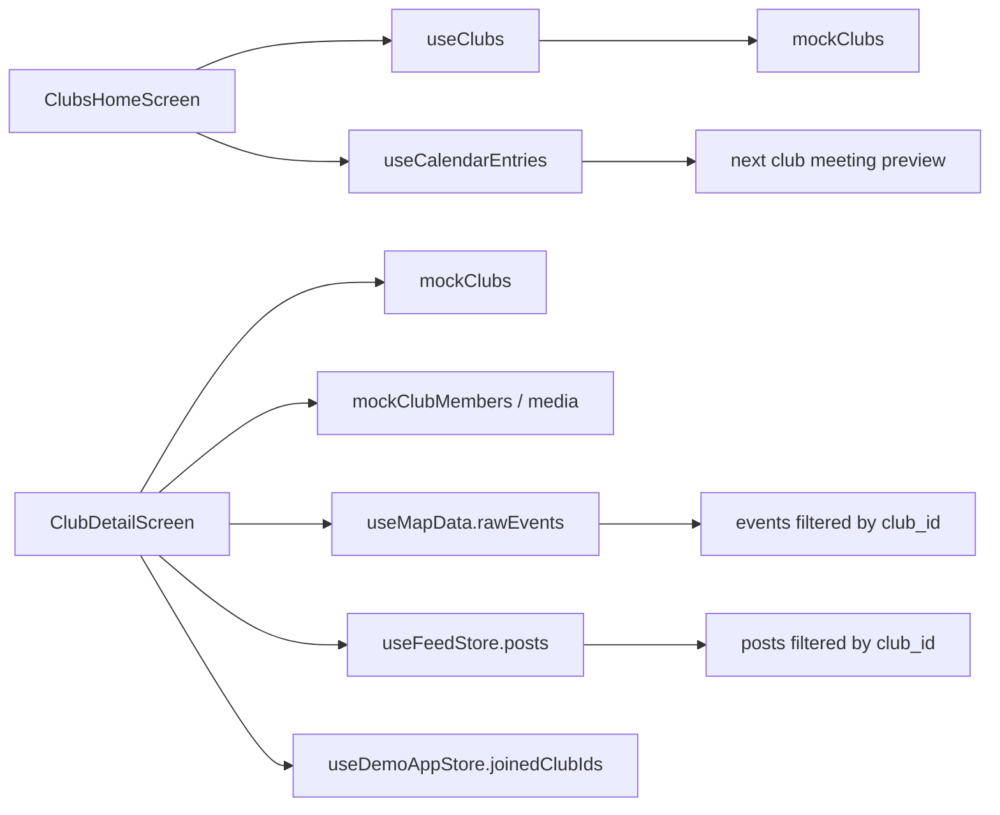

# xUMD Data Flow Diagram

This document maps how data moves through xUMD today:

1. Supabase tables and key columns
2. Foreign-key relationships between tables
3. Edge functions and client services that read/write those tables
4. Shared stores and React Query caches
5. Which screens render which data
6. Where the app uses local fallback or mock data instead of Supabase

This is intentionally based on the current code paths in `src/` and `supabase/`, not on intended future architecture.

## 1. Runtime Modes

xUMD runs in two distinct modes:

- `Supabase connected`
  - `RootNavigator` boots auth, onboarding, realtime subscriptions, and remote queries.
  - Main files:
    - `src/navigation/RootNavigator.tsx`
    - `src/features/auth/hooks/useAuth.ts`
    - `src/shared/hooks/useEventPresenceSync.ts`
- `Demo / fallback`
  - If `isSupabaseConfigured === false`, the app still renders from mock assets, local Zustand stores, AsyncStorage, and derived local search/calendar logic.
  - Main files:
    - `src/shared/stores/useDemoAppStore.ts`
    - `src/shared/stores/useEventCatalogStore.ts`
    - `src/features/feed/hooks/useFeed.ts`
    - `src/features/social/hooks/useSocialGraph.ts`
    - `src/features/search/utils/localSearch.ts`
    - `src/features/calendar/services/calendar.ts`

## 2. Database Relationship Diagram

## 3. Table Reference

The column lists below focus on fields that are either rendered directly in the UI or used to compute UI state.

### 3.1 `public.users`

Source:

- `supabase/migrations/202604040000_social_graph_core.sql`
- `supabase/migrations/20260407_auth_otp_onboarding.sql`

Key columns:

- `id uuid`
  - PK, also FK to `auth.users.id`
- `email text`
- `username text`
- `display_name text`
- `bio text`
- `avatar_url text`
- `major text`
- `graduation_year int`
- `degree_type text`
- `minor text`
- `pronouns text`
- `clubs text[]`
  - convenience profile list used by some UI fallbacks
- `courses text[]`
  - convenience profile list used by onboarding/profile/calendar fallbacks
- `interests text[]`
- `notification_prefs jsonb`
- `push_token text`
- `follower_count int`
- `following_count int`
- `profile_completed boolean`
- `onboarding_step int`
- `created_at timestamptz`
- `updated_at timestamptz`

Used in UI:

- auth session profile hydration
- onboarding completion
- profile home
- edit profile
- social graph cards
- post authors
- event organizers
- calendar viewer identity

### 3.2 `public.follows`

Source:

- `supabase/migrations/202604040000_social_graph_core.sql`

Key columns:

- `id uuid`
- `follower_id uuid -> users.id`
- `following_id uuid -> users.id`
- `created_at timestamptz`

Used in UI:

- followers/following counts and lists
- follow buttons in feed/search/profile/social
- people recommendations

### 3.3 `public.posts`

Source:

- `supabase/migrations/202604040000_social_graph_core.sql`
- `supabase/migrations/202604130000_club_relationship_compatibility.sql`
- `supabase/migrations/202604130001_legacy_feed_event_aliases.sql`

Key columns:

- `id uuid`
- `user_id uuid -> users.id`
- `author_id uuid -> users.id`
  - legacy compatibility alias used by some older client code
- `club_id uuid -> clubs.id`
- `content_text text`
- `content text`
  - compatibility alias; newer UI mostly uses `content`
- `media_urls text[]`
- `media_type post_media_type`
- `hashtags text[]`
- `like_count int`
- `comment_count int`
- `share_count int`
- `is_pinned boolean`
- `moderation_status moderation_status`
- `created_at timestamptz`
- `updated_at timestamptz`

Used in UI:

- feed tab cards
- post detail
- my posts
- other users' recent activity and post lists
- club announcements and recent club posts

### 3.4 `public.comments`

Source:

- `supabase/migrations/202604040000_social_graph_core.sql`
- `supabase/migrations/202604130001_legacy_feed_event_aliases.sql`

Key columns:

- `id uuid`
- `post_id uuid -> posts.id`
- `user_id uuid -> users.id`
- `author_id uuid -> users.id`
- `parent_id uuid -> comments.id`
  - threaded replies
- `content_text text`
- `content text`
- `like_count int`
- `moderation_status moderation_status`
- `created_at timestamptz`
- `updated_at timestamptz`

Used in UI:

- post detail comment thread
- post comment counts

### 3.5 `public.post_likes`

Source:

- `supabase/migrations/202604040000_social_graph_core.sql`

Key columns:

- `post_id uuid -> posts.id`
- `user_id uuid -> users.id`
- `created_at timestamptz`

Derived behavior:

- trigger updates `posts.like_count`

Used in UI:

- heart state and like count on feed and post detail

### 3.6 `public.content_reports`

Source:

- `supabase/migrations/202604040000_social_graph_core.sql`

Key columns:

- `id uuid`
- `reporter_id uuid -> users.id`
- `content_type text`
- `content_id uuid`
- `reason text`
- `created_at timestamptz`

Used in UI:

- moderation/report actions for social content

### 3.7 `public.clubs`

Source:

- `supabase/migrations/20260406_unified_search.sql`

Key columns:

- `id uuid`
- `name text`
- `slug text`
- `description text`
- `short_description text`
- `category text`
- `tags text[]`
- `logo_url text`
- `cover_image_url text`
- `cover_url text`
- `meeting_schedule text`
- `location_name text`
- `location_id uuid -> campus_locations.id`
- `contact_email text`
- `instagram_handle text`
- `social_links jsonb`
- `member_count int`
- `is_active boolean`
- `created_by uuid -> users.id`
- `created_at timestamptz`
- `updated_at timestamptz`

Used in UI:

- clubs home
- club detail hero/about/members/media
- profile "My Clubs"
- common clubs on user profiles
- search club results
- event host club references

### 3.8 `public.club_members`

Source:

- `supabase/migrations/202604130000_club_relationship_compatibility.sql`

Key columns:

- `club_id uuid -> clubs.id`
- `user_id uuid -> users.id`
- `role text`
  - `member | officer | president | admin`
- `status text`
  - `pending | approved | rejected`
- `joined_at timestamptz`
- `created_at timestamptz`
- `updated_at timestamptz`

Derived behavior:

- trigger recalculates `clubs.member_count`

Used in UI:

- club member roster
- club leadership role display
- join/leave logic
- "My Clubs" and membership shortcuts

### 3.9 `public.club_media`

Source:

- `supabase/migrations/202604130000_club_relationship_compatibility.sql`

Key columns:

- `id uuid`
- `club_id uuid -> clubs.id`
- `url text`
- `type text`
  - `photo | video`
- `caption text`
- `created_by uuid -> users.id`
- `created_at timestamptz`

Used in UI:

- club detail media tab

### 3.10 `public.campus_locations`

Source:

- `supabase/migrations/202604050000_campus_map_events.sql`

Key columns:

- `id uuid`
- `name text`
- `short_name text`
- `latitude double precision`
- `longitude double precision`
- `building_type enum`
- `floor_count int`
- `address text`
- `created_at timestamptz`

Used in UI:

- event location snapping and detail
- map campus location metadata
- clubs meeting location FK
- course building lookup
- personal calendar block optional location

### 3.11 `public.events`

Source:

- `supabase/migrations/202604050000_campus_map_events.sql`
- `supabase/migrations/202604130000_club_relationship_compatibility.sql`
- `supabase/migrations/202604130001_legacy_feed_event_aliases.sql`

Key columns:

- `id uuid`
- `title text`
- `description text`
- `organizer_id uuid -> users.id`
- `created_by uuid -> users.id`
- `organizer_name text`
- `club_id uuid -> clubs.id`
- `category event_category_enum`
- `location_name text`
- `location_id uuid -> campus_locations.id`
- `latitude double precision`
- `longitude double precision`
- `starts_at timestamptz`
- `ends_at timestamptz`
- `status event_status_enum`
- `cover_image_url text`
- `image_url text`
- `tags text[]`
- `attendee_count int`
- `interested_count int`
- `max_capacity int`
- `is_featured boolean`
- `moderation_status moderation_status`
- `flagged_categories jsonb`
- `created_at timestamptz`
- `updated_at timestamptz`

Derived behavior:

- trigger computes runtime `status`
- trigger keeps legacy aliases (`created_by`, `image_url`) in sync
- RSVP triggers sync `attendee_count` and `interested_count`

Used in UI:

- map pins, live counters, peek cards, event sheets
- event detail screens
- explore featured events
- saved events
- club detail events
- calendar event entries
- search event results

### 3.12 `public.event_rsvps`

Source:

- `supabase/migrations/202604050000_campus_map_events.sql`

Key columns:

- `id uuid`
- `event_id uuid -> events.id`
- `user_id uuid -> users.id`
- `status event_rsvp_status_enum`
  - `going | interested`
- `created_at timestamptz`

Derived behavior:

- trigger syncs `events.attendee_count` and `events.interested_count`

Used in UI:

- event RSVP state
- saved events
- calendar event source
- map/event detail optimistic state and badge rendering

### 3.13 `public.event_reports`

Source:

- `supabase/migrations/202604050000_campus_map_events.sql`

Key columns:

- `id uuid`
- `event_id uuid -> events.id`
- `reporter_id uuid -> users.id`
- `reason enum`
- `details text`
- `created_at timestamptz`

Derived behavior:

- trigger can move an event to moderation pending after enough reports

Used in UI:

- event report flow from map/event detail

### 3.14 `public.courses`

Source:

- `supabase/migrations/20260407_auth_otp_onboarding.sql`

Key columns:

- `id uuid`
- `course_code text`
- `section text`
- `title text`
- `credits int`
- `instructor text`
- `meeting_days text[]`
- `start_time time`
- `end_time time`
- `building_name text`
- `room_number text`
- `location_id uuid -> campus_locations.id`
- `semester text`
- `is_online boolean`
- `is_async boolean`
- `created_at timestamptz`

Used in UI:

- onboarding course search
- profile/course sync
- calendar course entries

### 3.15 `public.user_courses`

Source:

- `supabase/migrations/20260407_auth_otp_onboarding.sql`

Key columns:

- `id uuid`
- `user_id uuid -> users.id`
- `course_id uuid -> courses.id`
- `course_code text`
- `section text`
- `semester text`
- `meeting_days text[]`
- `start_time time`
- `end_time time`
- `building_name text`
- `room_number text`
- `created_at timestamptz`

Used in UI:

- personalized calendar schedule
- onboarding persistence

### 3.16 `public.calendar_personal_blocks`

Source:

- `supabase/migrations/20260408_calendar_sync.sql`

Key columns:

- `id uuid`
- `user_id uuid -> users.id`
- `title text`
- `location_name text`
- `location_id uuid -> campus_locations.id`
- `latitude double precision`
- `longitude double precision`
- `starts_at timestamptz`
- `ends_at timestamptz`
- `recurrence text`
- `recurrence_days integer[]`
- `created_at timestamptz`
- `updated_at timestamptz`

Used in UI:

- add/edit/delete personal blocks in calendar
- conflict calculations

### 3.17 `public.calendar_sync_preferences`

Source:

- `supabase/migrations/20260408_calendar_sync.sql`

Key columns:

- `user_id uuid -> users.id`
- `token text`
- `include_courses boolean`
- `include_events_going boolean`
- `include_events_interested boolean`
- `include_club_meetings boolean`
- `include_personal_blocks boolean`
- `last_synced_at timestamptz`
- `created_at timestamptz`
- `updated_at timestamptz`

Used in UI:

- calendar sync settings screen
- ICS/feed URL generation

### 3.18 `public.saved_searches`

Source:

- `supabase/migrations/20260406_unified_search.sql`

Key columns:

- `id uuid`
- `user_id uuid -> users.id`
- `query text`
- `filters jsonb`
- `notify boolean`
- `created_at timestamptz`

Used in UI:

- not currently the main path
- current search history UI uses AsyncStorage instead

### 3.19 Search / recommendation support tables

These are backend infrastructure tables. They matter for data flow even if the UI does not render them directly.

`public.content_embeddings`

- `entity_type`
- `entity_id`
- `content_text`
- `embedding`
- `updated_at`

`public.post_embeddings`

- `post_id`
- `embedding`
- `created_at`

`public.user_interest_vectors`

- `user_id`
- `interest_vector`
- `last_computed_at`

`public.feed_cache`

- `user_id`
- `post_id`
- `score`
- `computed_at`

`public.people_recommendations`

- `user_id`
- `recommended_user_id`
- `score`
- `reason`
- `computed_at`

Used in UI indirectly through edge functions:

- feed ranking
- people recommendations
- semantic search

## 4. Client Service and Edge Function Map

### 4.1 Auth and onboarding

Client:

- `src/services/auth.ts`
- `src/features/auth/hooks/useAuth.ts`

Edge functions:

- `request-otp`
- `check-username`
- `search-courses`

Tables touched:

- `auth.users`
- `users`
- `courses`
- `user_courses`

### 4.2 Map and event discovery

Client:

- `src/services/mapEvents.ts`
- `src/features/map/hooks/useMapData.ts`
- `src/features/map/hooks/useMapEventDetail.ts`
- `src/features/map/hooks/useMapSearchResults.ts`
- `src/features/map/screens/MapHomeScreen.tsx`

Edge functions:

- `get-map-events`
- `get-event-detail`
- `create-event`
- `rsvp-event`
- `report-event`
- `search-events`

Tables touched:

- `events`
- `event_rsvps`
- `event_reports`
- `users`
- `clubs`
- `campus_locations`

### 4.3 Feed and social graph

Client:

- `src/services/social.ts`
- `src/features/feed/hooks/useCampusFeed.ts`
- `src/features/social/hooks/useCampusSocialGraph.ts`

Edge functions:

- `get-feed`
- `get-trending`
- `get-recommendations`
- `follow-user`
- `submit-post`

Tables touched:

- `users`
- `posts`
- `comments`
- `post_likes`
- `follows`
- `people_recommendations`
- `feed_cache`
- `content_reports`

### 4.4 Search and discovery hub

Client:

- `src/services/search.ts`
- `src/features/search/hooks/useSearchQueries.ts`
- `src/features/search/utils/localSearch.ts`

Edge functions:

- `search-autocomplete`
- `unified-search`
- `search-semantic`
- `extract-search-filters`

Tables touched:

- `events`
- `clubs`
- `users`
- `campus_locations`
- `content_embeddings`
- `saved_searches` only as future/backlog capability, not the main current UI path

### 4.5 Calendar

Client:

- `src/features/calendar/services/calendar.ts`
- `src/features/calendar/hooks/useCalendarEntries.ts`

Edge functions:

- `calendar-feed`

Tables touched:

- `user_courses`
- `courses`
- `event_rsvps`
- `events`
- `calendar_personal_blocks`
- `calendar_sync_preferences`
- `users`

## 5. Shared Client State and Cache Layers

### 5.1 React Query

Key query keys:

- `['map-events', ...]`
- `['map-event-detail', eventId]`
- `['calendar-data', viewerId, joinedClubKey, goingKey, savedKey]`
- `['calendar-sync', viewerId]`
- `['search', 'autocomplete', query]`
- `['search', 'results', query, entityTypes]`
- `['search', 'discovery']`

### 5.2 Zustand stores

`useDemoAppStore`

- source of fallback RSVP, saved-event, and joined-club state
- file: `src/shared/stores/useDemoAppStore.ts`

`useEventCatalogStore`

- shared fallback event catalog
- hydrated from map queries and reused by local search/calendar/detail paths
- file: `src/shared/stores/useEventCatalogStore.ts`

`useCrossTabNavStore`

- cross-tab handoff state
- map focus from search/calendar/event detail
- calendar focus from event detail/explore
- file: `src/shared/stores/useCrossTabNavStore.ts`

`useFeedStore`

- fallback/local feed state and optimistic updates
- file: `src/features/feed/hooks/useFeed.ts`

`useSocialGraphStore`

- fallback social graph and recommendation state
- file: `src/features/social/hooks/useSocialGraph.ts`

## 6. UI Data Flow by Feature

### 6.1 App boot and session resolution

Rendered output:

- auth screens if session missing
- onboarding screens if `users.profile_completed = false`
- main 7-tab shell otherwise

### 6.2 Map tab

Primary files:

- `src/features/map/screens/MapHomeScreen.tsx`
- `src/features/map/hooks/useMapData.ts`
- `src/features/map/hooks/useMapEventDetail.ts`
- `src/features/map/components/CampusMap.native.tsx`
- `src/features/map/components/CampusMap.web.tsx`

Flow:

Rendered data:

- map pins from `events.latitude`, `events.longitude`, `events.category`, `events.status`
- top counter from event timestamps
- peek cards from event title, image, organizer, RSVP state
- event detail sheet from `event`, `host club`, organizer, RSVP stats, friends attending

Write paths:

- create event
  - `create-event` edge function
  - writes `events`
- RSVP / interested toggle
  - `rsvp-event` edge function
  - writes `event_rsvps`
  - invalidates map/calendar/detail caches
- report event
  - `report-event` edge function
  - writes `event_reports`

### 6.3 Event detail screen

Primary file:

- `src/features/explore/screens/EventDetailScreen.tsx`

Flow:

- reads `rawEvents` from `useMapData`
- reads richer detail from `useMapEventDetail(eventId)`
- reads local RSVP presence from `useDemoAppStore`
- writes RSVP through `submitEventRsvpRemote`
- sets cross-tab navigation via `useCrossTabNavStore`

Rendered data:

- hero image from `events.image_url`
- host club from `events.club_id -> mockClubs` in current UI path
- attendance from `rsvp_stats.going` / `events.attendee_count`
- calendar jump and map jump from cross-tab store

### 6.4 Calendar tab

Primary files:

- `src/features/calendar/hooks/useCalendarEntries.ts`
- `src/features/calendar/services/calendar.ts`
- `src/features/calendar/screens/CalendarHomeScreen.tsx`
- `src/features/calendar/screens/AddPersonalBlockScreen.tsx`
- `src/features/calendar/screens/CalendarSyncSettingsScreen.tsx`

Flow:

Rendered data:

- `courses` become `CalendarEntry(type='course')`
- joined-club schedules become `CalendarEntry(type='club_meeting')`
- RSVP events become `CalendarEntry(type='event_going' | 'event_interested')`
- personal blocks become `CalendarEntry(type='personal')`
- conflict sheet is derived client-side from overlapping entry times

Write paths:

- add/update/delete personal block
  - writes `calendar_personal_blocks` or AsyncStorage fallback
- sync settings changes
  - writes `calendar_sync_preferences` or AsyncStorage fallback

Important note:

- The calendar is not a full campus-wide event browser.
- It renders your schedule sources: your event RSVPs, your club meetings, your courses, and your personal blocks.

### 6.5 Explore tab

Primary file:

- `src/features/explore/screens/ExploreHomeScreen.tsx`

Flow:

- mini calendar strip comes from `useCalendarEntries`
- featured events come from `useMapData({ timeFilter: 'today' })`
- taps hand off into:
  - event detail
  - club detail
  - full calendar
  - map focus

Rendered data:

- calendar preview from normalized `CalendarEntry[]`
- featured event cards from `events`

### 6.6 Feed tab

Primary files:

- `src/features/feed/hooks/useCampusFeed.ts`
- `src/features/feed/screens/FeedHomeScreen.tsx`

Flow:

Rendered data:

- author avatar/name from joined `users`
- post body and media from `posts.content` and `posts.media_urls`
- counts from `posts.like_count`, `posts.comment_count`, `posts.share_count`
- personalized badge from edge-function metadata `suggested_reason`
- follow buttons from social graph hook

Write paths:

- toggle like
  - writes `post_likes`
  - `posts.like_count` stays in sync via DB trigger
- create post
  - current main remote path is `submit-post`
  - fallback path is `useFeedStore.createPost`

### 6.7 Post detail

Primary file:

- `src/features/feed/screens/PostDetailScreen.tsx`

Flow:

- consumes feed store / post id
- comment thread and comment creation rely on post/comment state
- social/comment table shape comes from `posts`, `comments`, `post_likes`, `users`

Rendered data:

- post author, content, media
- threaded comments via `comments.parent_id`
- count consistency from `posts.comment_count` and `posts.like_count`

### 6.8 Search tab

Primary files:

- `src/features/search/hooks/useSearchQueries.ts`
- `src/features/search/screens/SearchHomeScreen.tsx`
- `src/services/search.ts`
- `src/features/search/utils/localSearch.ts`

Flow:

Rendered data:

- people results from `users` or social fallback profiles
- event results from `events`
- club results from `clubs` or mock clubs
- location results from `campus_locations` or local `buildings`
- trending hashtags from `posts.hashtags` plus event tags in fallback mode

Write paths:

- current visible recent-search UI writes to AsyncStorage via `useRecentSearches`
- `saved_searches` exists in schema but is not the primary current screen path

### 6.9 Clubs tab

Primary files:

- `src/features/clubs/hooks/useClubs.ts`
- `src/features/clubs/screens/ClubsHomeScreen.tsx`
- `src/features/clubs/screens/ClubDetailScreen.tsx`

Important split:

- `ClubsHomeScreen` is still mostly mock-driven through `useClubs()`
- `ClubDetailScreen` now mixes:
  - mock club core data
  - shared event stream from `useMapData().rawEvents`
  - shared feed posts from `useFeedStore`
  - joined-club state from `useDemoAppStore`

Flow:

Rendered data:

- club hero/about from `clubs`-shaped data
- event tab from `events.club_id`
- member tab from `club_members`
- media tab from `club_media`
- announcement/recent post sections from `posts.club_id`

Write paths:

- join/leave club currently updates demo store and auth profile `clubs[]`
- admin post composer writes into feed store fallback
- media composer writes into local club media state

Important consistency note:

- Club detail is closer to the shared event/feed graph than clubs home is.
- Clubs home is still one of the clearest remaining mock-first surfaces.

### 6.10 Profile tab

Primary files:

- `src/features/profile/hooks/useProfile.ts`
- `src/features/profile/screens/ProfileHomeScreen.tsx`
- `src/features/profile/screens/SavedEventsScreen.tsx`
- `src/features/profile/screens/MyPostsScreen.tsx`
- `src/features/profile/screens/ConnectionsScreen.tsx`

Flow:

- profile identity comes from:
  - `useAuth().user` if Supabase session exists
  - otherwise `useProfileStore` seeded from mock user data
- profile home enriches with:
  - joined clubs from `useDemoAppStore`
  - saved events from `useDemoAppStore`
  - local/remote posts from `useFeedStore` plus `fetchRemotePostsByUser`
  - followers/following/recommendations from `useCampusSocialGraph`

Rendered data:

- profile card from `users`
- "My Clubs" from club membership shortcuts plus club image fields
- "People You May Know" from social graph recommendations
- quick access cards from local counts and routes

### 6.11 Other users' profiles

Primary file:

- `src/features/social/screens/UserProfileScreen.tsx`

Flow:

- remote path
  - `fetchRemoteProfileById`
  - `fetchRemotePostsByUser`
- fallback path
  - `useSocialGraphStore`
  - `mockUsers`
  - `useFeedStore.posts`

Rendered data:

- profile hero from `users`
- common clubs by intersecting viewer and target club ids
- recent activity by deriving from target posts
- post list from target authored posts

### 6.12 Campus tab

Primary files:

- `src/features/campus/screens/CampusHomeScreen.tsx`
- `src/features/campus/screens/LibrariesScreen.tsx`

Important note:

- `CampusHomeScreen` is currently local-content driven, not database driven.
- It reads `src/experience/content.ts`.
- Libraries are also local-data-first, with live hours fetched from the public UMD libraries website.

Data sources:

- `campusCards`, `quickLinks` from `src/experience/content.ts`
- `libraryProfiles` from `src/features/campus/data/libraries.ts`
- `useLibraryHours()` fetches `https://www.lib.umd.edu/visit/libraries`

There is no main Supabase table currently driving the campus tiles.

## 7. Cross-Screen Consistency Paths

These are the most important consistency seams in the current app.

### 7.1 Event consistency

Shared sources:

- `useMapData` hydrates `useEventCatalogStore`
- `useCalendarEntries` builds event entries from `event_rsvps` or fallback event catalog
- `EventDetailScreen` reads from `useMapData` plus `useMapEventDetail`
- `Search localSearch.ts` reads from `useEventCatalogStore`
- `ClubDetailScreen` event tab filters `useMapData().rawEvents`
- `SavedEventsScreen` filters `useMapData().rawEvents`

Result:

- map, event detail, club event tab, saved events, and local search are mostly aligned around the same `Event` shape

### 7.2 RSVP consistency

Shared state:

- canonical persistence is `event_rsvps`
- client-side local mirror is `useDemoAppStore.goingEventIds` and `savedEventIds`
- `useEventPresenceSync` hydrates that mirror from `getMyRsvps`

Affected screens:

- map event sheets
- event detail
- calendar event entries
- saved events
- map peek cards "Going" badges

### 7.3 Feed and club consistency

Shared link:

- `posts.club_id -> clubs.id`

Affected screens:

- feed
- club detail announcements
- club detail recent posts
- my posts
- user profile recent activity

Current limitation:

- `posts` do not yet carry a canonical `event_id`, so a feed announcement can be club-linked without being directly attached to one specific event row.

### 7.4 Social consistency

Shared link:

- `follows`
- `people_recommendations`
- `users`

Affected screens:

- feed suggestions
- search people results
- profile recommendations
- connections
- public user profile

## 8. Legacy and Parallel Paths to Watch

These files still exist, but they are not the main runtime path for the current app shell:

- `src/services/feed.ts`
- `src/services/clubs.ts`
- `src/services/events.ts`

Why this matters:

- they perform direct table reads/writes
- some joins still use older compatibility patterns like `profiles!author_id`
- current primary UI mostly routes through:
  - `useCampusFeed`
  - `useCampusSocialGraph`
  - `useMapData`
  - `useCalendarEntries`
  - `useProfile`

If you are fixing consistency bugs, start with the hook/screen path actually used by the UI, not these older helper files.

## 9. Current Consistency Gaps

These are the most important architecture gaps visible from the current code:

- `ClubsHomeScreen` is still mock-first while `ClubDetailScreen` is partially synced to shared event/feed state.
- `posts` are club-linked but not event-linked.
- search recent history is AsyncStorage-based, while `saved_searches` exists in the schema but is not the visible main path.
- campus home and many campus utility surfaces are local content, not Supabase tables.
- profile `clubs[]` on `users` is a convenience array, while canonical club membership is really `club_members`.
- profile `courses[]` on `users` is also a convenience array; canonical enrolled schedule is `user_courses`.

## 10. Practical "Trace This in UI" Cheat Sheet

If you want to trace a visible item on-screen back to storage quickly:

- A map pin:
  - `MapHomeScreen -> useMapData -> services/mapEvents.ts -> get-map-events -> events`
- An RSVP badge:
  - `useDemoAppStore` hydrated by `useEventPresenceSync -> getMyRsvps -> event_rsvps`
- A feed post:
  - `FeedHomeScreen -> useCampusFeed -> services/social.ts -> get-feed -> posts + users`
- A club announcement on club detail:
  - `ClubDetailScreen -> useFeedStore.posts filtered by post.club_id`
- A club event card:
  - `ClubDetailScreen -> useMapData().rawEvents filtered by event.club_id`
- A calendar event block:
  - `CalendarHomeScreen -> useCalendarEntries -> loadCalendarSourceData -> event_rsvps + events`
- A user's follower count:
  - `UserProfileScreen/ProfileHomeScreen -> useCampusSocialGraph -> follows/users or fallback social store`
- A search event result:
  - `SearchHomeScreen -> useUnifiedSearch -> services/search.ts -> unified-search or localSearch -> events`
